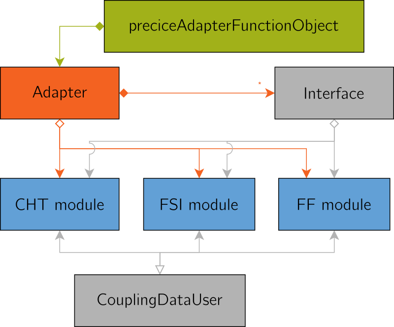

## Architecture

The OpenFOAM adapter separates the core functionality (e.g. calling preCICE methods) from the problem-specific methods (e.g. accessing fields and converting quantities). The latter is encapsulated into "modules", which add only a few lines of code in the core. The following, simplified UML diagram gives an overview:

While in the beginning the adapter only included a module for conjugate heat transfer, [a module for fluid-structure interaction](https://github.com/precice/openfoam-adapter/pull/56) and [a module for fluid-fluid coupling](https://github.com/precice/openfoam-adapter/pull/67) have been added since then.

## Starting points

In case you just want to couple a different variable, you need to create a new
coupling data user class in the `preciceAdapter::CHT` namespace or in a new one.
Then you need to add an option for it in the configuration part
to add objects of it into the `couplingDataWriters` and `couplingDataReaders`
whenever requested.

There are some `NOTE`s in the files [Adapter.H](https://github.com/precice/openfoam-adapter/blob/master/Adapter.H), [Adapter.C](https://github.com/precice/openfoam-adapter/blob/master/Adapter.C), [CHT/CHT.C](https://github.com/precice/openfoam-adapter/blob/master/CHT/CHT.C), and [CHT/Temperature.H](https://github.com/precice/openfoam-adapter/blob/master/CHT/Temperature.H) to guide you through the process.

_Note:_ make sure to include any additional required libraries in the `LIB_LIBS`
section of the `Make/options`. Since the adapter is a shared library,
another missing library will trigger an "undefined symbol" runtime error.

See also the notes and discussion in [issue #7: Create a module for fluid-structure interaction](https://github.com/precice/openfoam-adapter/issues/7).
